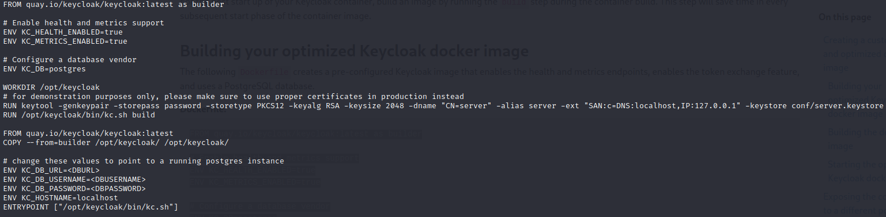
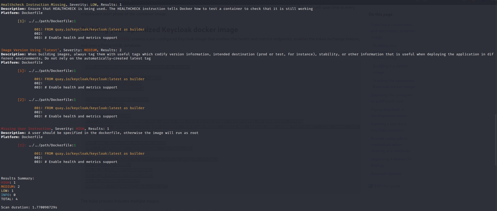
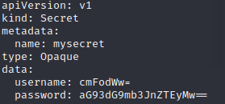
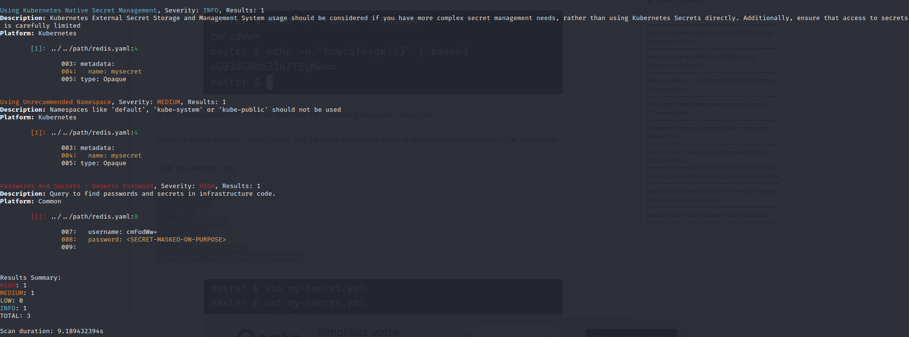
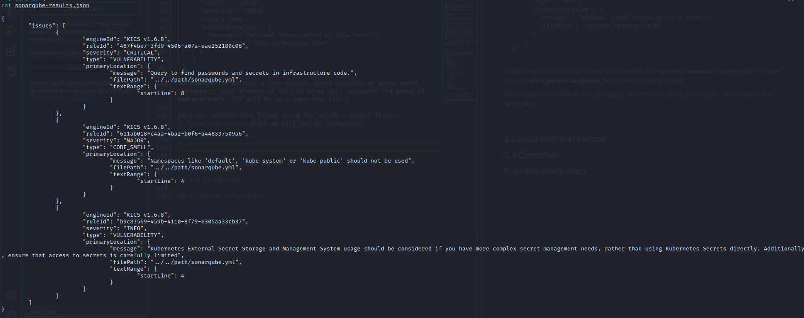

# Jenkins-Sonarqube-KICS-integration-doc
Description: As it was difficult to me to link the three together and as I did find any documentation on the subject, here it is.

---

## Summary
1. [Prerequisites](#prequisites)
2. [What is KICS](#2-what-is-kics)

3. [Link Sonarqube and KICS](#3-link-sonarqube-and-kics)

   3.1 [KICS's sonarqube report format](#31-kicss-sonarqube-report-format)
   
   3.2 [Issues](#32-issues)

   3.3 [Correction](#33-correction)

4. [Jenkins integration](#4-jenkins-integration)
---

## 1. Prequisites

In order to keep this document as light as possible I will assume that you already have **Jenkins** and **Sonarqube** installed on your machines, and that they can already communicate together. I will also assume that you have the basic understanding of some mecanics such as sonar-project.properties and sonar-scanner.

You will also need to have **Docker** installed to use KICS, if you don't want to install KICS locally, so in short you need:
- Docker
- Sonaraqube
- Jenkins
- A working communciation between your Sonarqube and Jenkins instances

## 2. What is KICS

To quickly understand what [KICS](https://docs.kics.io/) does, it is a static analysis tool that will, launch on a project, show misconfigurations on yaml file, Dockerfile, and such, using rules [(policy language)](https://www.openpolicyagent.org/docs/latest/policy-language/)

Here is an example of the kind of output KICS produces on a misconfigured Dockerfile and yaml file:

Dockerfile             |  KICS output
:-------------------------:|:-------------------------:
  |  

In this Dockerfile, KICS reported a few bad pratices, some of them are less critical than other, for instance an instance of healthcheck which purpose is to know if the container is still performing as it should and the absence of a user in the Docker. If a user is not given in a Dockerfile it means that all commands are run as root and as such, if a hacker find a weakness in your dockers' application / server and succesfully obtain a reverse shell. It means he will have a root access on your docker and it will be easier for him to perform a pivot on the host, obtain further access / information, etc.

Kubernetes             |  KICS output
:-------------------------:|:-------------------------:
  |  

Needless to say, that is a lot of bad pratices for such a small file.

KICS is a usefull tool as it is 'kick', can analyse big project, gives a helput and precise description of what is wrong and where it is, using a simple command at the root of a project:

```
docker run -v $PWD:/path checkmarx/kics:latest scan -p "/path"
```

## 3. Link Sonarqube and KICS

## 3.1 KICS's sonarqube report format

Before our KICS output can be visible on sonarqube we first need to use sonar-scanner. Following the [sonarqube's documentation](https://docs.sonarqube.org/9.6/analyzing-source-code/importing-external-issues/generic-issue-import-format/), we can find the generic report format compatible to import external issue:

```
{ "issues": [
    {
      "engineId": "test",
      "ruleId": "rule1",
      "severity":"BLOCKER",
      "type":"CODE_SMELL",
      "primaryLocation": {
        "message": "fully-fleshed issue",
        "filePath": "sources/A.java",
        "textRange": {
          "startLine": 30,
          "endLine": 30,
          "startColumn": 9,
          "endColumn": 14
        }
      },
      "effortMinutes": 90,
      "secondaryLocations": [
        {
          "message": "cross-file 2ndary location",
          "filePath": "sources/B.java",
          "textRange": {
            "startLine": 10,
            "endLine": 10,
            "startColumn": 6,
            "endColumn": 38
          }
        }
      ]
    },
    {
      "engineId": "test",
      "ruleId": "rule2",
      "severity": "INFO",
      "type": "BUG",
      "primaryLocation": {
        "message": "minimal issue raised at file level",
        "filePath": "sources/Measure.java"
      }
    }
]}
```
To summary it, we have a json output, which contains an array named **issues**, each element of this an array will represent **a group of bad pratice**. (It will be very important later)

KICS can achieve this format using the option --report-formats \<formats-wanted\>, which we will set to 'sonarqube'

```
docker run -v $PWD:/path checkmarx/kics:latest scan -p "/path" --report-formats sonarqube -o "/path"
```

Which will create a sonarqube-results.json file:


## 3.2 Issues

Your next step would be to add this file to sonar-sconnar using either the sonar-project.properties by adding the line *'sonar.externalIssuesReportPaths=./sonarqube-results.json'* or by adding it as an argument of our sonar-scanner like so *'sonar-scanner -Dsonar.externalIssuesReportPaths=./sonarqube-results.json'*

If you this, your KICS report will be ignored by the sonar-scanner and the only way I found was to use the absolute path of the report and not the relative path, such that 
*'sonar.externalIssuesReportPaths=./sonarqube-results.json'* -> *'sonar.externalIssuesReportPaths=/[...]/sonarqube-results.json'*

Now that you have corrected this, you will another error, sonar-scanner will know ignore each element of **issues** saying that he doesn't find the document. Which is understandable because when you look at the report you will find the key 'filePath' which correspond to the file where the issue was found.

The path precised need to be the same as your project, or I higly doubt that your project path is '../../path/\<your file\>. To make it easier you can change your docker command so that your project path is the same:

```
docker run -v $PWD:$PWD checkmarx/kics:latest scan -p $PWD --report-formats sonarqube -o $PWD
```

But even in this case you will need to remove the extra characters '../..' at each filePath key.

But it doesn't stop there, some files from the report may still be ignored as it also need to be indexed by the sonar-scanner using either sonar.sources or sonar.tests (warning: a file cannot be indexed twice so be careful when indexing file with sonar.tests and sonar.sources).

I promess it is the last one =)

Now that you have done all of this, you should see your report on sonarqube, but not all of them. This is because you may have the key 'secondaryLocations' in your sonarqube-results.json report, and you will find that each file listed in it are those that are absent from sonarqube.
 
In order to patch that you will need modify your sonarqube-results.json so that each secondaryLocations no longer exist and are replaced by new elements of the **issues** array so that:

```
{ "issues": [
    {
      "engineId": "test",
      "ruleId": "rule1",
      "severity":"BLOCKER",
      "type":"CODE_SMELL",
      "primaryLocation": {
        "message": "fully-fleshed issue",
        "filePath": "sources/A.java",
        "textRange": {
          "startLine": 30,
          "endLine": 30,
          "startColumn": 9,
          "endColumn": 14
        }
      },
      "effortMinutes": 90,
      "secondaryLocations": [
        {
          "message": "cross-file 2ndary location",
          "filePath": "sources/B.java",
          "textRange": {
            "startLine": 10,
            "endLine": 10,
            "startColumn": 6,
            "endColumn": 38
          }
        }
      ]
    },
    {
      "engineId": "test",
      "ruleId": "rule2",
      "severity": "INFO",
      "type": "BUG",
      "primaryLocation": {
        "message": "minimal issue raised at file level",
        "filePath": "sources/Measure.java"
      }
    }
]}

become

{ "issues": [
    {
      "engineId": "test",
      "ruleId": "rule1",
      "severity":"BLOCKER",
      "type":"CODE_SMELL",
      "primaryLocation": {
        "message": "fully-fleshed issue",
        "filePath": "sources/A.java",
        "textRange": {
          "startLine": 30,
          "endLine": 30,
          "startColumn": 9,
          "endColumn": 14
        }
      },
      "effortMinutes": 90,
    },
    {
      "engineId": "test",
      "ruleId": "rule1",
      "severity":"BLOCKER",
      "type":"CODE_SMELL",
      "primaryLocation": {
        "message": "fully-fleshed issue",
        "filePath": "sources/B.java",
        "textRange": {
          "startLine": 10,
          "endLine": 10,
          "startColumn": 6,
          "endColumn": 38
        }
      },
      "effortMinutes": 90,
    },
    {
      "engineId": "test",
      "ruleId": "rule2",
      "severity": "INFO",
      "type": "BUG",
      "primaryLocation": {
        "message": "minimal issue raised at file level",
        "filePath": "sources/Measure.java"
      }
    }
]}

```

This seems very complicated and you may want to give up, but don't worry I did that part for you so you don't have to, go to [Correction](#33-correction).

Summary:
1. Use the **absolute path** when you specify the reports path
2. Make sure that the filePath value corresponds to the **absolute path** leading to the 'ill' file
3. Be sure that each file reported in the 'filePath' element has been indexed by sonar-scanner
4. Be sure not to have any 'secondaryLocations' key

## 3.3 Correction

In this repository you will find a python file (kics_correction.py), feel free to edit it if necessary.

The goal of this script is to replace all 'secondaryLocations' by new **issues**, for more information see part [Issues](#32-issues)

It can also remove the extra characters '../..' by adding the -f option.

Use it in the directory where your sonarqube-results.json is present and all the work is done, just be sure to have python3 installed, no pip command is needed.

```
./kics_correction.py -f
```

## 4 Jenkins integration

The jenkins integration is pretty straight forward and be found here, without the correction I did

```
stage('KICS scan') {
            steps {
                script {
                    docker.image('checkmarx/kics:latest').inside("--entrypoint=''") {
                      unstash 'source'
                      sh('/app/bin/kics scan -p \'\$(pwd)\' --ci --report-formats html -o \'\$(pwd)\' --ignore-on-exit results')
                      archiveArtifacts(artifacts: 'results.html', fingerprint: true)
                      publishHTML([allowMissing: true, alwaysLinkToLastBuild: true, keepAll: true, reportDir: '.', reportFiles: 'results.html', reportName: 'KICS Results', reportTitles: ''])
                    }
                }
            }
        }
```

and then in your sonar-scanner operation you just need to add '-Dsonar.externalIssuesReportPaths=/[...]/sonarqube-results.json' as an argument or put it directly in your sonar-project-properties with this line 'sonar.externalIssuesReportPaths=/[...]/sonarqube-results.json'